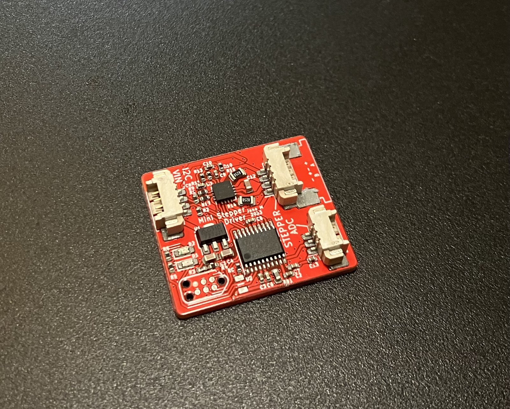
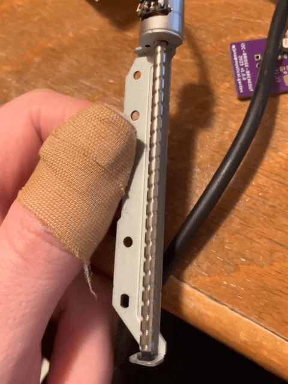
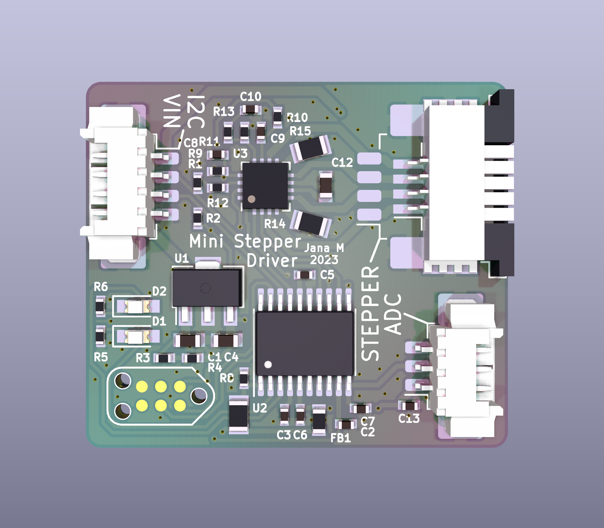
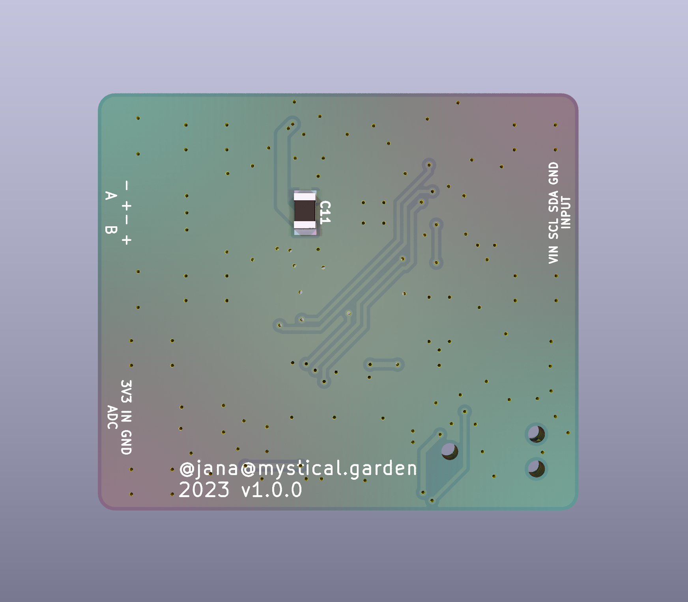

# mini-motor-controller

A motor controller for miniature stepper motors, such as used in CD head drives. The additional ADC input allows for position feedback. This project was intended to be used in a DIY motor fader, however this motorfader has not been designed yet.

It features a cheap STM32F030 as brains with I2C as main IO to the host controller, an onboard regulator allows for an input voltage of up to 10V. The motor driver is a STSPIN220 with up to 1.3Arms.

<table>
  <tbody>
    <tr>
      <td colspan="2">
        
      </td>
    </tr>
    <tr>
      <td>
        
      </td>
      <td>
        
      </td>
    </tr>
    <tr>
      <td>
        
      </td>
      <td>
        
      </td>
    </tr>
  </tbody>
</table>
