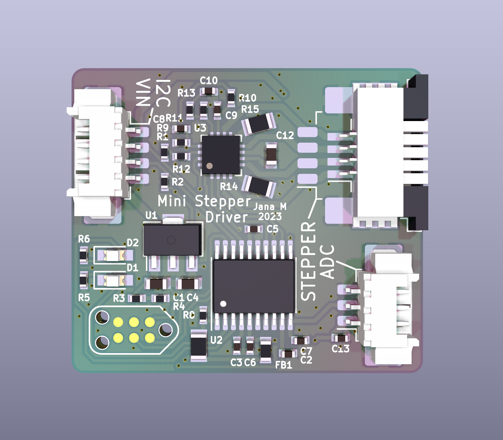
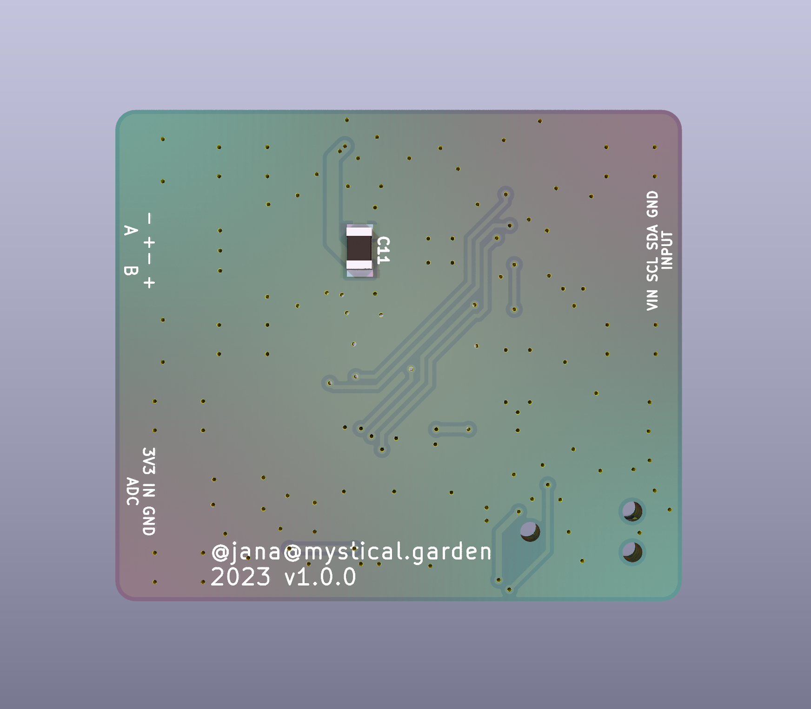

# mini-motor-controller

A motor controller for miniature stepper motors, such as used in CD head drives. The additional ADC input allows for position feedback.

*hardware is not tested yet, this notice will vanish as soon as it is tested :3*

